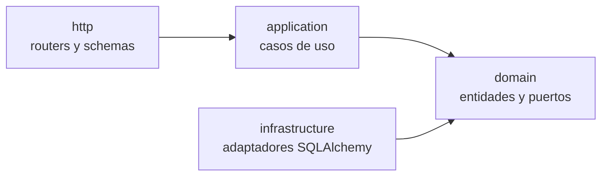
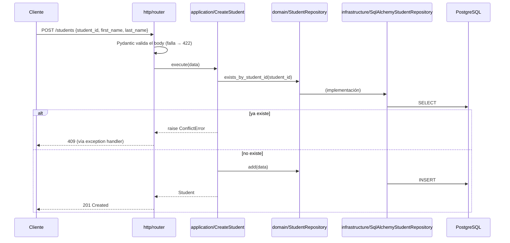

# Arquitectura del backend — S4

> Alcance: arquitectura interna del **backend** (`apps/api`). La vista general del sistema está en [`docs/ARCHITECTURE.md`](../../docs/ARCHITECTURE.md) y las decisiones en [`docs/adr/`](../../docs/adr/).

## 1. Visión general

S4 administra **estudiantes**, **clases** y la relación muchos a muchos entre ellos (**inscripciones**). El backend expone esta funcionalidad mediante una API REST y persiste los datos en PostgreSQL.

El backend sigue una **Clean Architecture** (puertos y adaptadores) **organizada por módulos**:

- **Por módulos:** todo lo relacionado con una entidad (estudiantes, clases, inscripciones) vive en una misma carpeta.
- **Por capas dentro de cada módulo:** cada módulo separa las reglas de negocio de los detalles técnicos (HTTP y base de datos).

## 2. Stack del backend

| Pieza | Tecnología | Rol |
|---|---|---|
| Lenguaje | Python 3.14 con type hints | Código tipado, verificado con mypy |
| Gestor de proyecto | uv | Dependencias, entorno virtual y lockfile reproducible (`uv.lock`) |
| Framework HTTP | FastAPI | Rutas, inyección de dependencias (`Depends`) y OpenAPI automático |
| Validación | Pydantic v2 | Esquemas de request/response; `pydantic-settings` para la configuración |
| Documentación del API | OpenAPI (FastAPI) + Scalar | Spec generada desde el código, publicada en `/docs` |
| Persistencia | PostgreSQL 18 + SQLAlchemy 2 (async, `asyncpg`) | Modelo relacional y queries tipadas |
| Migraciones | Alembic | Cambios de esquema versionados y reproducibles |
| Calidad | Ruff + mypy (strict) | Lint, formato y chequeo de tipos |
| Logs | structlog | Logs estructurados: legibles en desarrollo, JSON en producción |
| Tests | pytest + pytest-asyncio + httpx | Tests unitarios y de integración (estrategia con Postgres real: [ADR 0010](../../docs/adr/0010-estrategia-de-pruebas.md)) |

## 3. Capas y regla de dependencias



Las flechas significan "depende de". **`domain` no depende de nada**, y ninguna capa depende de `http`.

| Capa | Responsabilidad | Contiene | No debe contener |
|---|---|---|---|
| `domain` | Reglas y conceptos del negocio | Entidades (`dataclass`), **puertos** (`typing.Protocol`) | Imports de FastAPI, Pydantic o SQLAlchemy |
| `application` | Orquestar una acción del sistema | **Casos de uso** (una clase por acción) | Detalles de HTTP o SQL |
| `infrastructure` | Implementar los puertos con tecnología concreta | **Adaptadores** (repositorios SQLAlchemy) y modelos ORM | Reglas de negocio |
| `http` | Traducir HTTP ↔ casos de uso | Routers, schemas Pydantic, códigos de estado | Lógica de negocio ni acceso directo a la DB |

**Por qué esta separación:**

- **Testeabilidad:** los casos de uso reciben un *puerto* (`Protocol`). En los tests unitarios se usa una implementación en memoria, sin base de datos.
- **Reemplazabilidad:** cambiar el ORM o la base de datos afecta solo a `infrastructure`.
- **Lectura:** cada archivo responde a una sola pregunta (qué es, qué hace, cómo se guarda, cómo se expone).

Los schemas Pydantic (`http`) y los modelos ORM (`infrastructure`) son distintos de las entidades de dominio a propósito: el formato de la API y el de la tabla pueden cambiar sin afectar las reglas de negocio.

## 4. Estructura de carpetas

```
apps/api/
├── src/s4/
│   ├── modules/
│   │   ├── students/
│   │   │   ├── domain/
│   │   │   │   ├── student.py                     # entidad (dataclass)
│   │   │   │   └── student_repository.py          # puerto (Protocol)
│   │   │   ├── application/
│   │   │   │   ├── create_student.py
│   │   │   │   ├── update_student.py
│   │   │   │   ├── delete_student.py
│   │   │   │   ├── get_student.py
│   │   │   │   └── search_students.py
│   │   │   ├── infrastructure/
│   │   │   │   ├── student_model.py               # tabla (SQLAlchemy)
│   │   │   │   └── sqlalchemy_student_repository.py  # adaptador
│   │   │   └── http/
│   │   │       ├── schemas.py                     # request/response (Pydantic)
│   │   │       └── router.py                      # endpoints /students
│   │   ├── classes/                               # misma estructura
│   │   └── enrollments/                           # asignaciones y consultas cruzadas
│   │
│   ├── shared/
│   │   ├── errors.py                              # DomainError, NotFoundError, ConflictError...
│   │   ├── logging.py                             # configuración de structlog
│   │   ├── http/
│   │   │   ├── problem_details.py                 # respuestas RFC 9457
│   │   │   ├── error_handlers.py                  # excepción → código HTTP
│   │   │   └── health.py                          # /health y /health/ready
│   │   ├── database/
│   │   │   ├── base.py                            # DeclarativeBase + convención de nombres
│   │   │   ├── session.py                         # engine y sesión async
│   │   │   └── seed.py                            # datos de prueba (pendiente)
│   │   └── config.py                              # settings validadas (pydantic-settings)
│   │
│   ├── container.py                               # composition root (providers de Depends)
│   └── main.py                                    # create_app(): construye la app FastAPI
│
├── alembic/
│   ├── env.py
│   └── versions/                                  # migraciones versionadas
├── tests/
│   ├── unit/                                      # casos de uso con repositorios en memoria
│   └── integration/                               # endpoints contra PostgreSQL real
├── alembic.ini
├── pyproject.toml                                 # dependencias y config de Ruff, mypy y pytest
├── uv.lock
└── Dockerfile
```

Se usa el *src layout* (`src/s4/`) para que los tests importen el paquete instalado y no archivos sueltos del directorio.

### Archivos de arranque

| Archivo | Responsabilidad |
|---|---|
| `container.py` | **Composition root.** Único lugar donde se instancian los adaptadores concretos y se inyectan en los casos de uso, mediante funciones *provider* que usa `Depends`. |
| `main.py` | `create_app()` registra routers, exception handlers, middlewares y la documentación. Al ser una función *factory*, los tests pueden crear la app con otra configuración. |

```python
# container.py (ilustrativo)
SessionDep = Annotated[AsyncSession, Depends(get_session)]


def get_create_student(session: SessionDep) -> CreateStudent:
    return CreateStudent(SqlAlchemyStudentRepository(session))
```

```python
# application/create_student.py (ilustrativo)
class CreateStudent:
    def __init__(self, repository: StudentRepository) -> None:  # recibe el PUERTO
        self._repository = repository

    async def execute(self, data: NewStudent) -> Student:
        if await self._repository.exists_by_student_id(data.student_id):
            raise ConflictError(f"Student {data.student_id} already exists")
        return await self._repository.add(data)
```

Cada request obtiene su propia sesión de base de datos, que se cierra al terminar y revierte cualquier cambio no confirmado. Dónde se confirma la transacción (commit) se define junto con el modelo de datos ([ADR 0011](../../docs/adr/0011-modelo-de-datos.md)).

## 5. Flujo de una petición

Ejemplo: `POST /api/v1/students`



## 6. Manejo de errores

1. Los casos de uso lanzan **errores de dominio** (`NotFoundError`, `ConflictError`), que heredan de `DomainError`. No conocen los códigos HTTP.
2. **Exception handlers** registrados en `create_app()` (`shared/http`) traducen cada error a su respuesta HTTP:

| Error | HTTP |
|---|---|
| Validación de entrada (`RequestValidationError` de Pydantic) | 422 |
| `NotFoundError` | 404 |
| `ConflictError` | 409 |
| `IntegrityError` por violación de `UNIQUE` en PostgreSQL (`23505`) | 409 |
| Error no controlado | 500 (sin exponer detalles internos) |

3. Todas las respuestas de error usan el formato **Problem Details (RFC 9457)**, `application/problem+json`:

```json
{
  "type": "about:blank",
  "title": "Conflict",
  "status": 409,
  "detail": "Student A001 already exists",
  "instance": "/api/v1/students"
}
```

La unicidad se garantiza en dos niveles: el caso de uso la verifica para dar un mensaje claro, y la restricción `UNIQUE` de la base de datos la asegura ante condiciones de carrera.

## 7. Estrategia de pruebas por capa

| Capa | Tipo de test | Dependencias |
|---|---|---|
| `application` | Unitario (pytest) | Repositorios en memoria que cumplen el puerto |
| `infrastructure` + `http` | Integración (pytest + httpx) | PostgreSQL real; cómo se provee se decide en [ADR 0010](../../docs/adr/0010-estrategia-de-pruebas.md) |

## 8. Endpoints de soporte

| Endpoint | Uso |
|---|---|
| `GET /health` | *Liveness*: el proceso responde. Lo usa el healthcheck de Docker. |
| `GET /health/ready` | *Readiness*: la base de datos es alcanzable (503 si no). |
| `GET /docs` | Referencia del API (Scalar). |
| `GET /openapi.json` | Especificación OpenAPI generada. |

## 9. Imagen Docker

El `Dockerfile` es multi-stage:

| Stage | Uso |
|---|---|
| `dev` | Todas las dependencias (incluidas las de desarrollo) y `uvicorn --reload`. El código se sincroniza con `docker compose watch`. |
| `builder` | Instala solo las dependencias de producción en `/opt/venv`. |
| `runtime` | Imagen final: copia el entorno virtual y Alembic, y corre con un usuario sin privilegios. |

El entorno virtual vive en `/opt/venv`, fuera de `/app`, para que montar el código en `/app` (por ejemplo, al formatear o crear migraciones) no lo oculte.

## 10. Cómo agregar un módulo nuevo

1. Crear `src/s4/modules/<modulo>/` con las carpetas `domain`, `application`, `infrastructure` y `http`.
2. Definir la entidad y el puerto en `domain`.
3. Implementar los casos de uso en `application` (con sus tests unitarios).
4. Crear el modelo ORM en `infrastructure` y generar la migración con Alembic.
5. Implementar el adaptador en `infrastructure`.
6. Crear los schemas y el router en `http`.
7. Registrar los providers en `container.py` y el router en `main.py`.

Los módulos existentes no se modifican.
