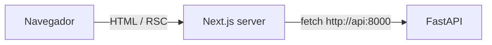

# Arquitectura del frontend — S4

> Alcance: arquitectura interna del **frontend** (`apps/web`). La vista general del sistema está en [`docs/ARCHITECTURE.md`](../../docs/ARCHITECTURE.md) y las decisiones en [`docs/adr/`](../../docs/adr/).

## 1. Visión general

Aplicación **Next.js 16 (App Router)** escrita en TypeScript estricto. Es la interfaz para gestionar estudiantes, clases e inscripciones; toda la lógica de negocio vive en el backend.

La organización aplica la misma idea que el backend: **separar por funcionalidad** y mantener las piezas técnicas compartidas aparte.

## 2. Stack del frontend

| Pieza | Tecnología | Rol |
|---|---|---|
| Framework | Next.js 16 (App Router, Turbopack) | Rutas, Server Components, Server Actions |
| UI | React 19 + React Compiler | Componentes; memoización automática |
| Estilos | Tailwind CSS v4 | Tokens de diseño en CSS (`@theme`) |
| Componentes | shadcn/ui (Radix, preset Nova) + Skiper UI | Código copiado al proyecto con `shadcn add`, en `src/shared/ui/` |
| Tema | Tokens de VengeanceUI (`--vng-*`) | Colores, radios y velocidades en un solo lugar (`globals.css`) |
| Lint y formato | Biome | Una sola herramienta en lugar de ESLint + Prettier |
| Gestor de paquetes | pnpm (vía Corepack) | Instalación reproducible con `pnpm-lock.yaml` |

Las librerías de interfaz y sus reglas de uso están en [ADR 0013](../../docs/adr/0013-ui-y-experiencia.md).

## 3. Estructura de carpetas

```
apps/web/
├── src/
│   ├── app/                      # SOLO rutas: layouts y páginas delgadas
│   │   ├── layout.tsx
│   │   └── page.tsx
│   ├── features/                 # una carpeta por funcionalidad
│   │   ├── home/                 #   components/ (hero, tarjetas), queries.ts
│   │   ├── students/             #   components/, actions.ts, queries.ts, schemas.ts, types.ts
│   │   ├── classes/              #   misma estructura; vista en grilla de tarjetas
│   │   └── enrollments/          #   paneles de inscripción, selector múltiple, acciones
│   └── shared/                   # piezas técnicas reutilizables
│       ├── api/                  #   schema.ts (generado desde OpenAPI) + types.ts (alias)
│       ├── config/server-env.ts  #   configuración de servidor (server-only)
│       ├── layout/               #   providers, encabezado, paleta ⌘K
│       ├── lib/
│       │   ├── api-client.ts     #   fetch tipado al API + ProblemDetails
│       │   └── utils.ts          #   cn() para unir clases de Tailwind
│       └── ui/                   #   componentes de diseño (shadcn, Skiper UI...)
├── public/
├── components.json               # configuración de shadcn (alias → src/shared)
├── next.config.ts                # output: "standalone"
├── biome.json
└── Dockerfile
```

| Carpeta | Responsabilidad | Regla |
|---|---|---|
| `app/` | Mapear URLs a pantallas | Las páginas componen piezas de `features/`; no contienen lógica de datos |
| `features/<x>/` | Todo lo de una funcionalidad: componentes, lectura de datos, mutaciones, validaciones | Una feature no importa otra feature; lo común sube a `shared/` |
| `shared/` | Código técnico sin conocimiento del negocio | No importa nada de `features/` |

## 4. Comunicación con el API



- El navegador solo habla con Next.js. Las lecturas se hacen en **Server Components** y las escrituras se harán con **Server Actions**; ambas llaman al API por la red interna de Docker (`API_INTERNAL_URL`).
- Ventajas: no hay CORS, la URL interna del API no se expone y la configuración se lee en tiempo de ejecución (la misma imagen sirve en cualquier entorno).
- `shared/lib/api-client.ts` centraliza las llamadas: si el API responde con error, lanza un `ApiError` con el Problem Details (RFC 9457) para mostrar mensajes claros.
- Los módulos de servidor importan `server-only`, así un error de importación desde un Client Component falla en el build.

### Patrón de una feature (ejemplo: `students`)

| Archivo | Rol |
|---|---|
| `queries.ts` | Lecturas desde Server Components (`server-only`) |
| `actions.ts` | Server Actions (`"use server"`) para crear, editar y eliminar: validan con Zod, llaman al API, traducen los Problem Details a errores por campo y llaman a `refresh()` |
| `schemas.ts` | Esquema Zod compartido por el formulario y las Server Actions (mismas reglas que el API) |
| `components/` | Vista cliente: búsqueda (`?q=` en la URL con debounce), tabla animada, panel de formulario y diálogo de confirmación |

Una feature no importa a otra: las páginas de detalle (`app/students/[id]`, `app/classes/[id]`) combinan el perfil de su feature con el panel de `enrollments`. La desinscripción usa `useOptimistic` (React 19): la fila desaparece al instante y vuelve si el servidor responde con error.

Las Server Actions son endpoints públicos, por eso validan la entrada otra vez en el servidor aunque el formulario ya lo haya hecho.

Los tipos de las respuestas del API **se generan desde su OpenAPI** (`src/shared/api/schema.ts`, con `make web-types`) y `src/shared/api/types.ts` les da nombres cortos. Si el backend cambia un campo, `tsc` marca cada uso en el front ([ADR 0012](../../docs/adr/0012-contrato-front-back.md)).

## 5. Imagen Docker

| Stage | Uso |
|---|---|
| `deps` | `pnpm install --frozen-lockfile` |
| `dev` | `next dev` con el código sincronizado por `docker compose watch` |
| `builder` | `next build` (incluye el chequeo de tipos) |
| `runtime` | Solo la salida `standalone` y los estáticos; usuario sin privilegios |

## 6. Versión de Next.js

Next.js 16 trae cambios respecto de versiones anteriores. Su documentación oficial viene dentro del paquete, en `node_modules/next/dist/docs/` (ver `AGENTS.md`); ante dudas sobre una API, esa es la referencia.
