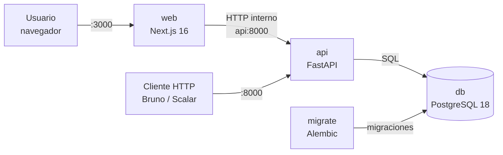
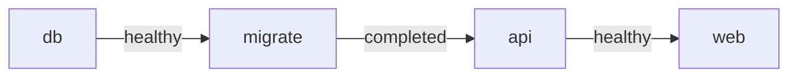

# Arquitectura — S4: Super Simple Scheduling System

Vista general del sistema. El detalle interno de cada aplicación está en su propio documento:

- Backend: [`apps/api/ARCHITECTURE.md`](../apps/api/ARCHITECTURE.md)
- Frontend: [`apps/web/ARCHITECTURE.md`](../apps/web/ARCHITECTURE.md)
- Decisiones técnicas: [`docs/adr/`](adr/README.md)

## 1. Componentes



| Servicio | Tecnología | Responsabilidad |
|---|---|---|
| `web` | Next.js 16 + React 19 + Tailwind v4 | Interfaz gráfica. Consulta el API desde el servidor de Next.js. |
| `api` | Python 3.14 + FastAPI + SQLAlchemy 2 | API REST, reglas de negocio, validaciones y documentación OpenAPI. |
| `migrate` | Alembic (misma imagen que `api`) | Aplica las migraciones una vez y termina. |
| `db` | PostgreSQL 18 | Persistencia e integridad referencial. |

Cada aplicación tiene su propio `Dockerfile` y se puede desplegar por separado. `compose.yml` solo describe cómo correrlas juntas.

## 2. Orden de arranque



Cada servicio espera a que el anterior esté listo (`depends_on` + healthchecks). Si una migración falla, el API no arranca.

## 3. Estructura del repositorio

```
s4/
├── apps/
│   ├── api/              # backend (Python, Clean Architecture por módulos)
│   └── web/              # frontend (Next.js, organizado por features)
├── docs/
│   ├── ARCHITECTURE.md   # este documento
│   └── adr/              # registro de decisiones
├── compose.yml           # sistema completo con imágenes de producción
├── compose.dev.yml       # overrides de desarrollo (hot reload)
├── Makefile              # comandos del proyecto (todos corren en Docker)
└── .env.example          # configuración de ejemplo, sin secretos reales
```

## 4. Entornos

| Modo | Comando | Imágenes | Recarga en caliente |
|---|---|---|---|
| Producción / evaluación | `make up` | stage `runtime` | No |
| Desarrollo | `make dev` | stage `dev` | Sí (Compose Watch) |

En ambos modos todo corre en contenedores: el host solo necesita Docker y make ([ADR 0006](adr/0006-docker-first.md)).

## 5. Configuración y secretos

- La configuración se lee de variables de entorno. `.env.example` documenta todas; `.env` está en `.gitignore`.
- La URL de la base de datos se compone en `compose.yml` a partir de `POSTGRES_*`, así las credenciales se definen en un solo lugar.
- El backend valida su configuración al arrancar (`pydantic-settings`): si falta una variable, no inicia.
